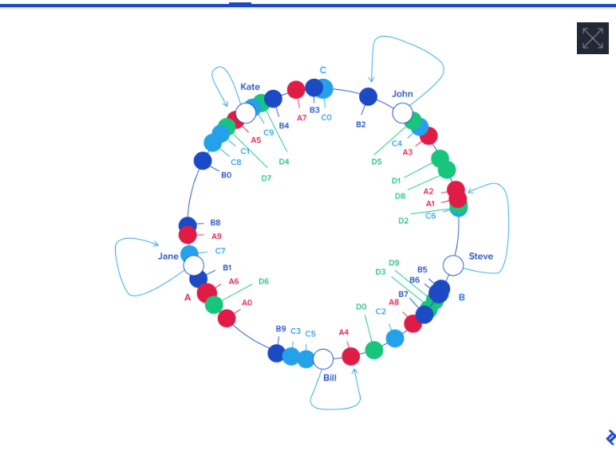

## How it works

**This image is good enough to describe:**



**This link also very good to describe**
https://www.toptal.com/big-data/consistent-hashing

## Code

```ruby
require 'digest'

class ConsistentHashing
  attr_reader :nodes

  def initialize(nodes = [], replicas = 3)
    @nodes = []
    @replicas = replicas
    add_nodes(nodes)
  end

  def add_node(node)
    replicas_for_node(node).each do |replica|
      @nodes[replica] = node
    end
  end

  def add_nodes(nodes)
    nodes.each { |node| add_node(node) }
  end

  def remove_node(node)
    replicas_for_node(node).each do |replica|
      @nodes.delete_at(replica)
    end
  end

  def get_node(key)
    return nil if @nodes.empty?

    hash = hash_key(key)
    idx = find_successor_index(hash)
    @nodes[idx]
  end

  private

  def replicas_for_node(node)
    (1..@replicas).map { |replica| hash_key("#{node}-#{replica}") % (2**32) }
  end

  def hash_key(key)
    Digest::SHA1.hexdigest(key.to_s).to_i(16)
  end

  def find_successor_index(hash)
    idx = @nodes.bsearch_index { |node| node >= hash }
    idx ||= 0
    idx % @nodes.size
  end
end

ch = ConsistentHashing.new(['NodeA', 'NodeB', 'NodeC'])

ch.add_node('NodeD')

puts ch.get_node('Key1')
puts ch.get_node('Key2')

ch.remove_node('NodeB')

puts ch.get_node('Key1')
puts ch.get_node('Key2')

```
