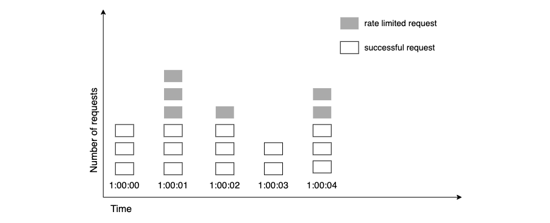

## How it works

**This image is good enough to describe:**




## Code
```ruby
class FixedWindowRateLimiter
  def initialize(capacity, window_size)
    @capacity = capacity
    @window_size = window_size
    @request_counts = {}
  end

  def allowed?(user_id)
    current_time = Time.now.to_i
    window_start = current_time - @window_size
    clean_old_requests(current_time)
    request_count = fetch_request_count(user_id, window_start, current_time)

    if request_count < @capacity
      increment_request_count(user_id, current_time)
      true
    else
      false
    end
  end

  private

  def fetch_request_count(user_id, time_start, time_end)
    request_counts = @request_counts[user_id] || []
    count = 0
    request_counts.each do |timestamp|
      count += 1 if timestamp >= time_start && timestamp <= time_end
    end
    count
  end

  def increment_request_count(user_id, current_time)
    @request_counts[user_id] ||= []
    @request_counts[user_id] << current_time
  end

  def clean_old_requests(current_time)
    @request_counts.each do |user_id, timestamps|
      timestamps.delete_if { |timestamp| timestamp < current_time - @window_size }
      @request_counts.delete(user_id) if timestamps.empty?
    end
  end
end


limiter = FixedWindowRateLimiter.new(60, 100)  # 60-second window and a maximum of 100 requests
user_id = 'example_user'

100.times do
  if limiter.allowed?(user_id)
    puts 'Request allowed'
  else
    puts 'Request blocked'
  end
end
```
