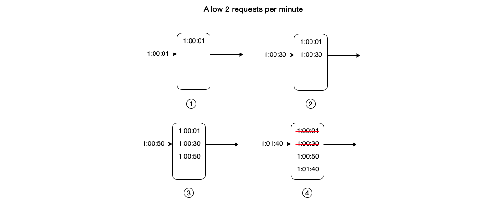

## How it works

**This image is good enough to describe:**




## Code
```ruby
class SlidingWindowRateLimiter
  def initialize(max_request, window_size)
    @max_request = max_request
    @window_size = window_size
    @request_log = []
  end

  def allowed_request?(user_id)
    current_time = Time.now.to_i
    clean_old_request(current_time)
    requests_count = get_requests_count(user_id)
    if requests_count < @max_request
      log_requests(current_time, user_id)
      true
    else
      false
    end
  end

  private

  def clean_old_request(current_time)
    @request_log.delete_if { |entry| entry[:timestamp] < current_time - @window_size }
  end

  def get_requests_count(user_id)
    @request_log.count { |entry| entry[:user_id] == user_id }
  end

  def log_requests(time_stamp, user_id)
    @request_log << { user_id: user_id, timestamp: time_stamp }
  end
end

limiter = SlidingWindowRateLimiter.new(60, 100)
user_id = 'example_user'

100.times do
  if limiter.allowed_request?(user_id)
    puts 'Request allowed'
  else
    puts 'Request blocked'
  end
end
```
