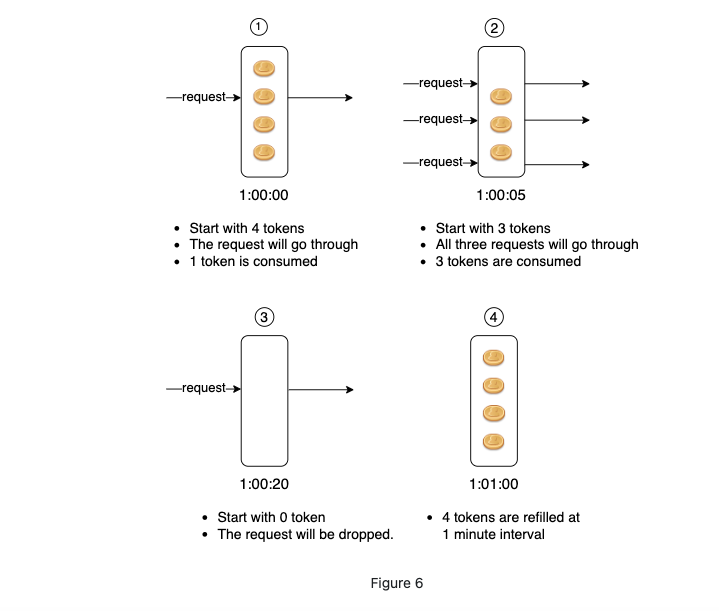

## How it works

**This image is good enough to describe:**




## Code
```ruby
class TokenBucketLimiter
  def initialize(bucket_capacity, refill_rate)
    @bucket_capacity = bucket_capacity.to_f
    @refill_rate = refill_rate.to_f
    @current_tokens = @bucket_capacity
    @last_refresh = Time.now
  end

  def forward?(token_needed=1)
    refresh_tokens

    if @current_tokens >= token_needed
        @current_tokens -= token_needed
        return true
    end
    false
  end

  private

  def refresh_tokens
    current_time = Time.now
    time_elapsed = current_time - @last_refresh
    new_tokens = @refill_rate * time_elapsed
    @current_tokens = [@current_tokens + new_tokens, @bucket_capacity].min
    @last_refresh = current_time
  end
end

limiter = TokenBucketLimiter.new(2, 2)

10.times do
  if limiter.forward?
    puts 'Request allowed'
  else
    puts 'Request denied'
  end
  sleep(0.3)
end
```
